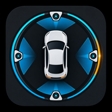

<p align="center">
  
</p>

<h1 align="center">BladeWatch</h1>

Free, open-source dashcam and sentry mode app built specifically for BYD vehicles with DiLink v3. All recordings and data stay on your device — no cloud, no accounts, no subscriptions. Optional remote viewing is direct, peer-to-peer through your own tunnel.

BladeWatch targets BYD DiLink v3 head units (`arm64-v8a`, Android 10+) and installs onto the car's head unit over ADB.

It ships as **two APKs that must both be installed**:

| APK | Package | Role |
|---|---|---|
| In-car UI | `net.bladewatch.flutter` | Everything you see and tap. The only launcher icon. |
| Service host | `net.bladewatch.app` | Daemons, recording, surveillance, BYD integration. No UI, no launcher icon. |

They share one Android UID, which is what lets the UI talk to the daemons over loopback IPC. That only works when **both are signed with the same key**, so install them as a pair and never mix builds from different sources.

## Quick Start (Use Pre-built APK)

Download **both** APKs from [GitHub Releases](../../releases) and install them on your BYD head unit.

Release builds are published **unsigned**, so the signing key never touches CI. Sign both with the same key before installing:

```bash
for f in bladewatch-*-unsigned.apk; do
  apksigner sign --ks release.jks --ks-key-alias key0 \
    --out "${f%-unsigned.apk}.apk" "$f"
done
# both digests must match, or the UI cannot reach the daemons:
apksigner verify --print-certs bladewatch-*-arm64-v8a.apk | grep 'SHA-256 digest'

adb install bladewatch-service-host-*-arm64-v8a.apk
adb install bladewatch-ui-*-arm64-v8a.apk
```

### 1. Prerequisites
- Ensure **Wireless ADB** is enabled on your device before launching the app.

### 2. Initial Configuration
1. **Authorize ADB:** On first launch, accept the ADB authentication prompt on your device screen.
2. **Background Persistence:** Open **BYD Auto-Start** and **uncheck BOTH** entries — **"BladeWatch"** (the UI) and **"BladeWatch Service"** (the daemons). That list *restricts* auto-start, so unchecking an entry is what allows it to start. Two entries appear because BladeWatch is two APKs. This is critical: on this head unit BYD suppresses the usual boot broadcast, so auto-start is what allows the app to run at boot at all. Clearing only the UI leaves the daemons dead. BYD re-applies the restriction on every install, so redo this after each update.

> ⚠️ **CRITICAL: Hard Reboot Required**
> After the first installation and initial run, you must hard reboot the device:
> Press and hold the **Volume Down** button for 5 seconds. Wait for the system to fully restart.
> This step is necessary to finalize the installation.

## Install with an AI Agent

Rather do none of the above by hand? Paste the block below into an agentic coding assistant
(Claude Code, Codex, Gemini CLI, Cursor, …) running on a computer that is on the same Wi-Fi
network as the car. It fetches and signs both APKs, installs them over ADB, and if the car is
not reachable it tells you how to switch ADB on in the head unit.

```text
Install BladeWatch (https://github.com/andrewloable/BladeWatch) on my BYD DiLink v3 head unit
over ADB. Run the commands yourself, one step at a time, and stop to ask me only where a step
says so.

Facts:
- BladeWatch is TWO APKs and both must be installed: the service host (package
  net.bladewatch.app, file bladewatch-service-host-*.apk) and the in-car UI (package
  net.bladewatch.flutter, file bladewatch-ui-*.apk). They share one Android UID, so both MUST
  be signed with the same key.
- The head unit is reached with ADB over Wi-Fi: adb connect <car-ip>:5555. It is arm64-v8a,
  Android 10 (API 29), reports manufacturer "BYD AUTO", and is not rooted (it does not need
  to be). Always pass -s <car-ip>:5555 to every adb command.

1. Tools. Make sure adb (Android platform-tools), apksigner (Android build-tools) and keytool
   (a JDK) are on PATH; install whatever is missing with this OS's package manager (macOS:
   brew install --cask android-platform-tools android-commandlinetools, then sdkmanager
   "build-tools;35.0.0"; Debian/Ubuntu: apt install adb apksigner default-jdk-headless).

2. APKs. If two already-signed BladeWatch APKs are in the current directory, use them.
   Otherwise download the two *-unsigned.apk assets of the latest release from
   https://github.com/andrewloable/BladeWatch/releases/latest (gh release download
   --repo andrewloable/BladeWatch --pattern '*.apk', or the GitHub releases API), then sign
   BOTH with the same key:
   - Ask me whether I have a keystore. If yes, ask for its path, alias and password. If not,
     create one: keytool -genkeypair -keystore bladewatch.jks -alias bladewatch -keyalg RSA
     -keysize 2048 -validity 10000 -dname "CN=BladeWatch" -storepass <password you choose>,
     then tell me to back that file up: every future update must be signed with this same
     key, or both packages have to be uninstalled first.
   - For each file: apksigner sign --ks <keystore> --ks-key-alias <alias>
     --ks-pass pass:<password> --out <name>.apk <name>-unsigned.apk
   - Then apksigner verify --print-certs on both signed APKs and confirm the SHA-256
     certificate digests are identical. Stop if they differ.

3. Connect. Run adb devices. If the car is already listed, use it. Otherwise ask me for the
   car's IP address and run adb connect <car-ip>:5555. If that fails (including "no route to
   host"), run adb kill-server && adb start-server and try once more: the local adb server
   gets stuck like this while the car is up. If it still fails, show me these instructions
   and wait for me:

   How to switch ADB on in the car:
   a) Put the car and this computer on the same Wi-Fi network, e.g. connect both to a phone
      hotspot.
   b) On the head unit open Settings, find Developer options (usually by tapping the version
      number under About several times) and switch on USB debugging.
   c) That alone is NOT enough on BYD: also switch on the head unit's own Wireless ADB /
      network debugging setting. A BYD system update can silently turn it back off.
   d) Read the car's IP address in the head unit's Wi-Fi settings and tell me.
   e) When the computer connects, the car's screen asks "Allow USB debugging?": tick
      "Always allow" and tap OK.

   Once connected, confirm it really is the car before installing anything:
   getprop ro.product.manufacturer must contain BYD, getprop ro.product.cpu.abi must be
   arm64-v8a and getprop ro.build.version.sdk must be 29 or higher. If not, stop and ask me.

4. Install. adb install -r the service host APK first, then the UI APK. If an install is
   rejected with INSTALL_FAILED_UPDATE_INCOMPATIBLE, INSTALL_FAILED_SHARED_USER_INCOMPATIBLE
   or INSTALL_FAILED_UID_CHANGED, an older BladeWatch signed with a different key is on the
   car: tell me, and only with my OK run adb uninstall net.bladewatch.flutter and
   adb uninstall net.bladewatch.app, ask me to hard-reboot the head unit (hold Volume Down
   for 5 seconds) so its old background daemons die, reconnect, and install again. Never
   uninstall anything without asking, and never touch /data/local/tmp/tor (it holds the
   car's permanent Tor address).

5. Verify. adb shell 'dumpsys package net.bladewatch.app | grep userId' and the same for
   net.bladewatch.flutter must print the same userId; if they differ the APKs were signed with
   different keys, go back to step 2. Then launch the UI:
   adb shell am start -n net.bladewatch.flutter/net.bladewatch.bladewatch_ui.MainActivity

6. Tell me what to do on the car's screen, in this order:
   - Accept the "Allow USB debugging?" prompt that appears on first launch. The app uses its
     own ADB key to start its background daemons; nothing works until this is accepted.
   - In the head unit's BYD Auto-Start settings, UNCHECK BOTH "BladeWatch" and
     "BladeWatch Service". That list restricts auto-start, so unchecking is what allows them
     to start; otherwise nothing runs when the car is switched on. BYD resets this on every
     install, so it must be redone after each update.
   - Hard-reboot the head unit: hold Volume Down for 5 seconds and wait for it to restart.

Report each step's result as you go. Do not make mistakes: read every command's output before
moving on, never guess an IP address or a package name, and if anything is ambiguous, stop
and ask me instead of guessing.
```

---

## Features

### Recording
- **Panoramic Dashcam** — Records the BYD 360° panoramic camera through a GPU mosaic pipeline (H.264/H.265), segmented into configurable clips with a recording library and calendar view for browsing and managing footage.
- **Proximity Recording (Market First)** — Uses BYD's 8 parking radar sensors to trigger recording only when objects approach the parked car. Configurable trigger levels, pre-event buffer, and 500ms debouncing.
- **Advanced Sentry Mode** — 24/7 surveillance with GPU motion detection, per-quadrant tracking, and an optional on-device AI object-recognition gate (TFLite YOLO11n). Supports safe-location zones, schedules, and pre/post-event windows.

### Vehicle & Driving
- **Vehicle Control** — Operate climate (AC, temperature, fan, max-cooling), windows (open/close and partial positioning), and seats (heat, ventilation, memory recall) directly from the app. Runs entirely through the local BYD SDK — no cloud account required.
- **3D Vehicle Hero** — An interactive 3D model of your car (Seal, Seal U, Dolphin, Atto 3, Han, Tang, and more) with a live state dashboard: doors, windows, battery SOC and range, per-tyre pressure, and climate.
- **Live Location** — Map view of the car's current position with a heading-rotated marker and a one-tap link out to Google Maps.
- **Trips & Analytics** — Trip history with route maps, telemetry, and driving insights.

### Monitoring & Remote Access
- **Real-time Performance Monitor** — CPU, GPU, memory usage, and battery voltage dashboard.
- **Diagnostics** — Network, storage, camera, and battery health checks.
- **Live Streaming** — Low-latency H.264 streaming over WebSocket with multiple view modes (all cameras, front, rear, left, right).
- **Remote Web App** — A full Angular web UI served by the on-device daemon, reachable from any browser through your tunnel. Token-protected.
- **Web Push Notifications** — Get surveillance event alerts pushed to your phone or desktop.
- **ADB Shell Runner** — Built-in terminal for running commands, checking processes, and viewing logs.
- **17 Languages** — Fully localized UI.

### Tor Onion Service
_(Versions before 1.3.1 used a different tunnel that required an account and an invite token. It has been removed; no migration is needed beyond enabling the Tor tunnel.)_

Remote access runs over a Tor v3 onion service: no account, no token, no sign-up, and no
device limit. The address is permanent — it survives restarts and reboots — so the QR code
on the Dashboard keeps working once you have scanned it.

**Setup:** enable the Tor tunnel under Daemons in the app. That is the whole setup. The
first start takes about 80 seconds while tor connects to the network (a few seconds
afterwards), and the Dashboard shows the QR code once it is actually reachable.

**Opening the address:** a `.onion` address does not work in Chrome or Safari. Install
[Tor Browser](https://www.torproject.org/download/) (Android, Windows, macOS, Linux) or
Onion Browser on iPhone and iPad, then scan or paste the address. The Dashboard's info
button shows the same instructions on the car's screen.

**The address is not a password.** Anyone who has it can reach your car's login page, so
the app's password still protects everything behind it — keep both to yourself.

Expect roughly 60–75 KB/s and a couple of seconds of latency per request: slower than a
direct connection, comfortably enough for the web UI and for live video.

> Should work on all BYD vehicles with DiLink v3 and the panoramic camera system.

## Building from Source

BladeWatch is a hybrid project built from three codebases:

- **`flutter_ui/`** — the in-car UI (Flutter/Dart), built as `net.bladewatch.flutter`.
- **`app/`** — the service host (Android/Kotlin/Java + C++), built as `net.bladewatch.app`. Owns the daemons, the camera/GPU pipeline and the BYD integration.
- **`web/`** — the Angular SPA the on-device daemon serves to remote browsers over your tunnel. Bundled into the service host APK.

The in-car UI was native Android until it was rewritten in Flutter; the Angular app is not the in-car UI and is only used by remote clients.

### Requirements
- Android SDK (`compileSdk 36`) and NDK `26.1.10909125`
- JDK 17 (the modules themselves target Java 11 bytecode)
- [Flutter](https://docs.flutter.dev/get-started/install) 3.44+ — for the in-car UI APK
- Node.js + npm — **required**, not optional. The Angular SPA is built during `preBuild` and
  neither `web/dist` nor its packaged copy is committed, so without Node the build fails rather
  than quietly producing an APK with no web UI.
- [`buf`](https://buf.build) — optional, only needed to regenerate the protobuf / ConnectRPC stubs

### Build

The two APKs build independently, from different toolchains:

```bash
# Service host (net.bladewatch.app) — also builds the Angular web UI and the
# native libraries, then bundles them into an arm64-v8a APK.
./gradlew assembleDebug
# Output: app/build/outputs/apk/debug/bladewatch-<branch>-arm64-v8a-debug.apk
#         (the git branch is embedded so builds stay distinguishable)

# In-car UI (net.bladewatch.flutter)
cd flutter_ui && flutter build apk --target-platform android-arm64 --debug
# Output: flutter_ui/build/app/outputs/flutter-apk/app-debug.apk
```

Both packages must report the **same UID** or the UI cannot reach the daemons:

```bash
adb shell 'dumpsys package net.bladewatch.app | grep userId'
adb shell 'dumpsys package net.bladewatch.flutter | grep userId'
```

Release builds without a keystore come out **unsigned** by design (see Quick Start).
Tagged releases are built by GitHub Actions — see `.github/workflows/release.yml`.

The Gradle build orchestrates everything:
- `buildAngularWebUI` builds the Angular app under `web/` and copies the output into the APK assets (hooked into `preBuild`; requires npm).
- Native dependencies (OpenH264, opencv-mobile, TensorFlow Lite) are auto-downloaded and checksum-verified — no manual download step.
- `generateConnectProtos` regenerates Java + TypeScript stubs from `proto/bladewatch/v1/*.proto` (only needed when the API schemas change).

The UI communicates with the daemon over a REST API and a 1:1 ConnectRPC layer on `127.0.0.1:8080`, with privileged operations going through loopback IPC on `127.0.0.1:19876`. For device install, daemon cleanup, and the full development workflow, see [`CLAUDE.md`](CLAUDE.md) and the [`docs/`](docs/) directory.

### Documentation
In-depth documentation lives in [`docs/`](docs/) — architecture, daemons and processes, IPC/auth/secrets, networking and tunnels, the HTTP API reference, BYD integrations, the surveillance pipeline, and storage.

## Privacy

- 100% local storage — all recordings saved on device
- No account required
- No cloud upload — remote viewing is direct via tunnels you control
- Open source — audit the code yourself

## Acknowledgments

- **3D BYD Vehicle Models** — The Vehicle Control page renders interactive 3D cars with [Three.js](https://threejs.org/), using base models from [ddiaz-design's BYD collection on Sketchfab](https://sketchfab.com/ddiaz-design/collections/byd-base-models-5bf92ab5f2be4ff6be5c3ac49f7099f3).

## License

Open source under MIT License. Your data stays on your device.
