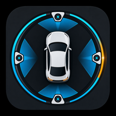

<p align="center">
  
</p>

<h1 align="center">BladeWatch</h1>

Free, open-source dashcam and sentry mode app built specifically for BYD vehicles with DiLink v3. All recordings and data stay on your device — no cloud, no accounts, no subscriptions. Optional remote viewing is direct and peer-to-peer, through the companion app.

BladeWatch targets BYD DiLink v3 head units (`arm64-v8a`, Android 10+) and installs onto the car's head unit over ADB.

**Contents:** [What's new](#whats-new-in-v1414) · [Install on the car](#quick-start-use-pre-built-apk) · [Install with an AI agent](#install-with-an-ai-agent) · [Features](#features) · [Remote access](#remote-access-pear) · [Install the companion app](#install-the-companion-app) · [Building from source](#building-from-source) · [Privacy](#privacy)

On the car it runs as **two APKs that must both be installed**:

| APK | Package | Role |
|---|---|---|
| In-car UI | `net.bladewatch.incarapp` | Everything you see and tap. The only launcher icon. |
| Service host | `net.bladewatch.app` | Daemons, recording, surveillance, BYD integration. No UI, no launcher icon. |

They share one Android UID, which is what lets the UI talk to the daemons over loopback IPC. That only works when **both are signed with the same key**, so install them as a pair and never mix builds from different sources.

A third app, the **companion** (`net.bladewatch.companionapp`), goes on your phone or computer, never on the car. It is optional, and it is how you reach the car remotely: see [Install the companion app](#install-the-companion-app).

## What's new in v1.4.1.4

A 6-digit PIN, held by the car, to keep Settings away from anyone with physical access — a
valet, a passenger, a child in the back seat.

- **Settings PIN lock, in the car and in every companion.** Turn it on from **Settings >
  Security** in the car (or **Settings** in the companion): set a PIN, and from then on opening
  Settings — Surveillance and Notifications too, in the companion — asks for it first. A wrong
  PIN says how many tries are left; five wrong PINs in a row lock entry out for a minute,
  doubling on each further miss. It is the car's PIN, not any one app's: every paired companion
  checks the same one.
- **Biometric unlock on the companion.** A phone or Mac with a fingerprint reader or face
  recognition can use it instead of typing the PIN each time — opt in from **Settings** after
  proving you know the PIN once. A failed or cancelled biometric check falls back to the PIN,
  with a button to try the sensor again.
- **A forgotten PIN isn't a lockout.** Any companion already unlocked by its own biometrics can
  change or clear the car's PIN without re-entering the old one. With no companion at hand, the
  PIN can also be cleared over ADB at the car — see
  [docs/ipc-auth-and-secrets.md](docs/ipc-auth-and-secrets.md#settings-pin-lock-bladewatch-hr6r).
- **One version everywhere:** 1.4.1.4.

### v1.4.1.3

Reach the car from mobile data while it is online through its own SIM, through a relay you run.

- **Your own relay, for the one case peer-to-peer cannot connect.** A car on its built-in SIM and a
  phone on mobile data both sit behind carrier NAT, and nothing could connect them. Now you can run
  a small relay on any Linux server with a public IPv4 address, such as a cheap cloud VPS: download
  [bladewatch-relay-v1.4.1.3.tar.gz](https://github.com/andrewloable/BladeWatch/releases/download/v1.4.1.3/bladewatch-relay-v1.4.1.3.tar.gz)
  from this release and set it up from [`relay/README.md`](relay/README.md), then turn on
  **Settings > Relay access > Use my relay** in the car and in each companion, with the same
  **Relay key**. Everything that connects
  directly today stays direct; the relay is only used when nothing else works.
- **The relay is yours alone.** Its key is 12 digits, like `4821-0937-5562`, and the relay refuses
  anyone without it, other BladeWatch owners included. It forwards encrypted data and cannot see
  your video or your car's data. BladeWatch ships no relay and no key: without one, nothing
  changes.
- **The relay key can be entered from the "can't reach the car" page** in the companion, because
  that is exactly when it is needed and the car's own settings are out of reach.
- **The Linux companion shows the full version** in About (it showed three parts).
- **One version everywhere:** 1.4.1.3.

Known, not fixed:

- Without a relay, **a phone on mobile data still cannot reach a car on its built-in SIM.** Put the
  phone on Wi-Fi, or set up a relay. See [Remote Access](#remote-access-pear).
- On the head unit, the VEHICLE card pushes the dashboard's tile row down far enough that it takes
  a short scroll to reach.

**Upgrading from v1.4.1.2:** the app IDs are unchanged, so both car APKs and the companion update
in place, and paired devices stay paired. Relay access is off until you turn it on. On Android,
take the companion APK for your device (`arm64-v8a` for a phone). BYD resets its Auto-Start
restriction on every install, so allow both BladeWatch entries again afterwards.

### v1.4.1.2

The companion comes to the TV, and devices without a camera pair without a QR.

- **The companion runs on Android TV** (Google TV, Sony BRAVIA and the like, 32-bit ones included)
  and is driven with the remote: a bright ring shows what is selected, up and down walk the side
  menu or the page and scroll it, and Events, Recordings, Trips, Surveillance and Location all work
  from the couch. On a TV, a clip's delete button is hidden (Select still deletes) so the remote
  lands on the clips, and the map is for looking at, not panning.
- **Pair a TV or a computer over Wi-Fi, by number.** With **Pair a device** open in the car and
  **Direct connection on this Wi-Fi** on, choose **Pair over Wi-Fi** on the device: both screens
  show the same six-digit number, and you tap **Pair** in the car if they match. Phones still scan
  the QR; the macOS app no longer offers the scan.
- **A PAIRED DEVICES card on the in-car dashboard** lists every paired phone, TV and computer, with
  when it was paired and a Remove button.
- **Smaller downloads.** The companion now comes as one file per kind of processor: three Android
  APKs (phones, 32-bit TVs, emulators) and two macOS zips (Apple silicon, Intel), each about half the
  size of the old all-in-one file. See [Install the companion app](#install-the-companion-app).
- **Direct connection finds the car more reliably** when it has moved to a new address on your
  Wi-Fi: the search now goes out a few addresses at a time instead of all at once, which some
  devices (a TV among them) silently dropped.
- **The car's startup screen counts while the services start.** Its timers stayed at "0s" until
  the first service answered.
- **The companion's Surveillance page drops its camera snapshots:** Live shows the cameras.
- **One version everywhere:** 1.4.1.2.

Known, not fixed:

- **A phone on mobile data cannot reach a car on its built-in SIM.** Both sit behind carrier NAT,
  which peer-to-peer connections cannot cross, and BladeWatch runs no relay. Put the phone on
  Wi-Fi in that case. See [Remote Access](#remote-access-pear).
- On the head unit, the VEHICLE card pushes the dashboard's tile row down far enough that it takes
  a short scroll to reach.

**Upgrading from v1.4.1.1:** the app IDs are unchanged, so both car APKs and the companion update
in place, and paired devices stay paired. On Android, take the companion APK for your device
(`arm64-v8a` for a phone). BYD resets its Auto-Start restriction on every install, so allow both
BladeWatch entries again afterwards.

### v1.4.1.1

A polish release for the dashboards, trips and the companion app. Pairing, recording and remote
access are unchanged.

- **Battery and fuel left as an amount, not just a percentage:** `77% / 14.1 kWh` and `30% / 14 L`,
  in the car and in the companion. The battery amount uses your car's pack size (from the model
  picked in the car's Vehicle dialog); the fuel amount appears once you enter your tank size in
  Settings > Trips. It is an estimate: battery health and BYD's reserve are not counted.
- **A VEHICLE card on the in-car dashboard.** Battery, EV range, fuel and fuel range moved out of
  THIS WEEK into their own card below it, so the week's card holds only the week.
- **The companion dashboard, reorganised.** Vehicle comes first (battery, range, fuel, fuel range,
  then charging, health and 12 V), This week below it. The duplicate SOC and total-range rows are
  gone, and so is the Battery capacity dialog: the pack size comes from the selected model.
- **The companion's Trips page now shows what the car shows:** 7, 14 and 30-day periods, the
  period summary with kWh/100km and the fuel, electric and total cost, each trip's cost, the
  driver score out of 500, the cost card, BYD's own fuel-range estimate, and driving DNA as bars.
  A trip's detail adds the energy used, and speeds and distances follow your km/mi setting.
- **Money looks the same in both apps** (`₱49.96`, not `49.96 PHP`).
- **Trip settings are easier to find in the companion:** Settings > Trips & costs > **Trip
  Analytics** (it was labelled "Electricity Rate"). The currency comes first, and the rates show
  their unit in it (`₱/kWh`, `₱/L`).
- **Tidier companion screens:** figures in a card share one size and line up, labels wrap between
  words instead of shrinking or breaking mid-word, and every bottom-bar label is the same size.
- **A speed test in the companion's Diagnostics:** the delay and download speed between your
  phone and the car, and whether it went over the car's Wi-Fi or Pear.
- **One version everywhere.** The companion now carries the car's version number, 1.4.1.1.

Known, not fixed:

- **A phone on mobile data cannot reach a car on its built-in SIM.** Both sit behind carrier NAT,
  which peer-to-peer connections cannot cross, and BladeWatch runs no relay. Put the phone on
  Wi-Fi in that case. See [Remote Access](#remote-access-pear).
- On the head unit, the new VEHICLE card pushes the dashboard's tile row down far enough that it
  takes a short scroll to reach.

**Upgrading from v1.4.1.0:** the app IDs are unchanged, so both car APKs and the companion update
in place, and a paired phone stays paired. BYD resets its Auto-Start restriction on every install,
so allow both BladeWatch entries again afterwards.

### v1.4.1.0

A redesign release: a new "cyberpunk HUD" look across the in-car UI and the companion app, in dark
and light. What the apps do and how you pair, record and control the car are unchanged.

- **A new look for the in-car UI, every screen.** Near-black panels with cyan and magenta accents
  and a soft glow in dark mode; white panels and the same accents in light mode. Thin bordered
  cards, uppercase tracked labels, and the Space Mono typeface. Cyan marks information, magenta
  marks live or needs-attention states, and every status dot reflects real state. Settings >
  Appearance still picks Auto, Light or Dark.
- **The companion matches.** The same look on your phone and computer: a side panel on wide
  windows, a bottom bar and a More sheet on phones, and every page (Dashboard, Live, Recordings,
  Events, Vehicle, Location, Trips, Diagnostics, Surveillance, Settings, pairing) restyled.
- **Costs show the currency symbol** you picked (`$`, `€`, `₱`), in both apps.
- **Bundled font, offline.** Space Mono ships inside both apps, so nothing is fetched. It covers
  Latin, Latin-Extended and Vietnamese; Japanese, Korean, Chinese, Thai, Hindi and Russian use the
  platform font for their own glyphs. Its licence (SIL OFL 1.1) is under Settings > About >
  License in the car and in Licenses in the companion.
- **Fixes found while testing on real devices:** even page gutters on Vehicle and Trips, chips that
  no longer scroll sideways on Recordings, the map attribution no longer overflows, and stacked form
  fields no longer touch.

Known, not fixed: the uppercase labels are not locale-aware in Turkish (a label such as "diğer"
shows as DIĞER, not DİĞER).

**Upgrading from v1.4.0.0:** the app IDs are unchanged, so both car APKs and the companion update
in place. BYD resets its Auto-Start restriction on every install, so allow both BladeWatch entries
again afterwards.

### Coming from v1.3.x: what v1.4.0.0 changed

- **Remote access is now the companion app, over Pear.** The Tor onion service is gone. A new
  companion app for your phone or computer (Android, macOS, Windows and Linux builds are on the
  release page; iOS builds from source) finds the car over Pear, a peer-to-peer network: no
  account, no server, nothing to forward on your router. Pair it once with the QR code on the car's
  Dashboard. On the car's own Wi-Fi it connects directly.
- **What the companion does:** live view of all four cameras (ten still frames a second), the
  recordings library with in-app playback and full-quality download, surveillance and proximity
  events, trips and driving stats, vehicle control (climate, windows, and more) behind the car's own
  safety interlock, diagnostics, and settings, in 17 languages. Clips are converted to a size the
  phone can play on demand, while downloads stay full quality.
- **Alerts arrive when the phone next connects.** Push notifications are gone: the car keeps the
  alerts it raised and the companion collects them each time it connects, so nothing goes through a
  third party.
- **The web app is gone.** The browser interface, its login and Web Push were removed; the car no
  longer serves web pages, and every client (the in-car UI and the companion) uses the same
  authenticated API.
- **Sturdier remote video.** Downloads and playback ride out dropped connections and resume,
  instead of failing.

**Upgrading from v1.3.x:** onion URLs and QR codes saved from v1.3.x stop working and nothing
migrates them, so pair the companion instead. The app IDs changed (`net.bladewatch.incarapp` for the
in-car UI, `net.bladewatch.companionapp` for the companion), so neither updates in place: install
the new in-car UI, then uninstall the old `net.bladewatch.flutter`. BYD resets its Auto-Start
restriction on every install, so allow both BladeWatch entries again afterwards. Full notes are on
each [release page](../../releases).

## Quick Start (Use Pre-built APK)

Download **both** car APKs from [GitHub Releases](../../releases) and install them on your BYD head unit. The same release also carries the companion app builds for your phone or computer (see [Install the companion app](#install-the-companion-app)); those never go on the car.

Release builds are published **unsigned**, so the signing key never touches CI. Sign both with the same key before installing:

```bash
for f in bladewatch-service-host-*-unsigned.apk bladewatch-ui-*-unsigned.apk; do
  apksigner sign --ks release.jks --ks-key-alias key0 \
    --out "${f%-unsigned.apk}.apk" "$f"
done
# both digests must match, or the UI cannot reach the daemons:
apksigner verify --print-certs bladewatch-*-arm64-v8a.apk | grep 'SHA-256 digest'

adb install bladewatch-service-host-*-arm64-v8a.apk
adb install bladewatch-ui-*-arm64-v8a.apk
```

### 1. Prerequisites
- Ensure **Wireless ADB** is enabled on your device before launching the app.

### 2. Initial Configuration
1. **Authorize ADB:** On first launch, accept the ADB authentication prompt on your device screen.
2. **Background Persistence:** Open **BYD Auto-Start** and **uncheck BOTH** entries — **"BladeWatch"** (the UI) and **"BladeWatch Service"** (the daemons). That list *restricts* auto-start, so unchecking an entry is what allows it to start. Two entries appear because BladeWatch is two APKs. This is critical: on this head unit BYD suppresses the usual boot broadcast, so auto-start is what allows the app to run at boot at all. Clearing only the UI leaves the daemons dead. BYD re-applies the restriction on every install, so redo this after each update.

> ⚠️ **CRITICAL: Hard Reboot Required**
> After the first installation and initial run, you must hard reboot the device:
> Press and hold the **Volume Down** button for 5 seconds. Wait for the system to fully restart.
> This step is necessary to finalize the installation.

## Install with an AI Agent

Rather do none of the above by hand? Paste the block below into an agentic coding assistant
(Claude Code, Codex, Gemini CLI, Cursor, …) running on a computer that is on the same Wi-Fi
network as the car. It fetches and signs both APKs, installs them over ADB, and if the car is
not reachable it tells you how to switch ADB on in the head unit.

```text
Install BladeWatch (https://github.com/andrewloable/BladeWatch) on my BYD DiLink v3 head unit
over ADB. Run the commands yourself, one step at a time, and stop to ask me only where a step
says so.

Facts:
- BladeWatch is TWO APKs and both must be installed: the service host (package
  net.bladewatch.app, file bladewatch-service-host-*.apk) and the in-car UI (package
  net.bladewatch.incarapp, file bladewatch-ui-*.apk). They share one Android UID, so both MUST
  be signed with the same key.
- The head unit is reached with ADB over Wi-Fi: adb connect <car-ip>:5555. It is arm64-v8a,
  Android 10 (API 29), reports manufacturer "BYD AUTO", and is not rooted (it does not need
  to be). Always pass -s <car-ip>:5555 to every adb command.

1. Tools. Make sure adb (Android platform-tools), apksigner (Android build-tools) and keytool
   (a JDK) are on PATH; install whatever is missing with this OS's package manager (macOS:
   brew install --cask android-platform-tools android-commandlinetools, then sdkmanager
   "build-tools;35.0.0"; Debian/Ubuntu: apt install adb apksigner default-jdk-headless).

2. APKs. If two already-signed BladeWatch APKs are in the current directory, use them.
   Otherwise download the two car APKs of the latest release,
   bladewatch-service-host-*-unsigned.apk and bladewatch-ui-*-unsigned.apk, from
   https://github.com/andrewloable/BladeWatch/releases/latest (gh release download
   --repo andrewloable/BladeWatch --pattern 'bladewatch-service-host-*.apk' --pattern
   'bladewatch-ui-*.apk', or the GitHub releases API). Do NOT install the
   bladewatch-companion-* files on the car: they are the phone/desktop app. Then sign
   BOTH car APKs with the same key:
   - Ask me whether I have a keystore. If yes, ask for its path, alias and password. If not,
     create one: keytool -genkeypair -keystore bladewatch.jks -alias bladewatch -keyalg RSA
     -keysize 2048 -validity 10000 -dname "CN=BladeWatch" -storepass <password you choose>,
     then tell me to back that file up: every future update must be signed with this same
     key, or both packages have to be uninstalled first.
   - For each file: apksigner sign --ks <keystore> --ks-key-alias <alias>
     --ks-pass pass:<password> --out <name>.apk <name>-unsigned.apk
   - Then apksigner verify --print-certs on both signed APKs and confirm the SHA-256
     certificate digests are identical. Stop if they differ.

3. Connect. Run adb devices. If the car is already listed, use it. Otherwise ask me for the
   car's IP address and run adb connect <car-ip>:5555. If that fails (including "no route to
   host"), run adb kill-server && adb start-server and try once more: the local adb server
   gets stuck like this while the car is up. If it still fails, show me these instructions
   and wait for me:

   How to switch ADB on in the car:
   a) Put the car and this computer on the same Wi-Fi network, e.g. connect both to a phone
      hotspot.
   b) On the head unit open Settings, find Developer options (usually by tapping the version
      number under About several times) and switch on USB debugging.
   c) That alone is NOT enough on BYD: also switch on the head unit's own Wireless ADB /
      network debugging setting. A BYD system update can silently turn it back off.
   d) Read the car's IP address in the head unit's Wi-Fi settings and tell me.
   e) When the computer connects, the car's screen asks "Allow USB debugging?": tick
      "Always allow" and tap OK.

   Once connected, confirm it really is the car before installing anything:
   getprop ro.product.manufacturer must contain BYD, getprop ro.product.cpu.abi must be
   arm64-v8a and getprop ro.build.version.sdk must be 29 or higher. If not, stop and ask me.

4. Install. adb install -r the service host APK first, then the UI APK. If an install is
   rejected with INSTALL_FAILED_UPDATE_INCOMPATIBLE, INSTALL_FAILED_SHARED_USER_INCOMPATIBLE
   or INSTALL_FAILED_UID_CHANGED, an older BladeWatch signed with a different key is on the
   car: tell me, and only with my OK run adb uninstall net.bladewatch.incarapp and
   adb uninstall net.bladewatch.app, ask me to hard-reboot the head unit (hold Volume Down
   for 5 seconds) so its old background daemons die, reconnect, and install again. Never
   uninstall anything without asking, and never touch /data/local/tmp/pear (it holds the
   car's permanent remote-access identity; deleting it unpairs every phone).

5. Verify. adb shell 'dumpsys package net.bladewatch.app | grep userId' and the same for
   net.bladewatch.incarapp must print the same userId; if they differ the APKs were signed with
   different keys, go back to step 2. Then launch the UI:
   adb shell am start -n net.bladewatch.incarapp/net.bladewatch.bladewatch_ui.MainActivity

6. Tell me what to do on the car's screen, in this order:
   - Accept the "Allow USB debugging?" prompt that appears on first launch. The app uses its
     own ADB key to start its background daemons; nothing works until this is accepted.
   - In the head unit's BYD Auto-Start settings, UNCHECK BOTH "BladeWatch" and
     "BladeWatch Service". That list restricts auto-start, so unchecking is what allows them
     to start; otherwise nothing runs when the car is switched on. BYD resets this on every
     install, so it must be redone after each update.
   - Hard-reboot the head unit: hold Volume Down for 5 seconds and wait for it to restart.

Report each step's result as you go. Do not make mistakes: read every command's output before
moving on, never guess an IP address or a package name, and if anything is ambiguous, stop
and ask me instead of guessing.
```

---

## Features

### Recording
- **Panoramic Dashcam** — Records the BYD 360° panoramic camera through a GPU mosaic pipeline (H.264/H.265), segmented into configurable clips with a recording library and calendar view for browsing and managing footage.
- **Proximity Recording (Market First)** — Uses BYD's 8 parking radar sensors to trigger recording only when objects approach the parked car. Configurable trigger levels, pre-event buffer, and 500ms debouncing.
- **Advanced Sentry Mode** — 24/7 surveillance with GPU motion detection, per-quadrant tracking, and an optional on-device AI object-recognition gate (TFLite YOLO11n). Supports safe-location zones, schedules, and pre/post-event windows.

### Vehicle & Driving
- **Vehicle Control** — Operate climate (AC, temperature, fan, max-cooling), windows (open/close and partial positioning), the sunroof, lights, ADAS options and the charge cap directly from the app. Runs entirely through the local BYD SDK — no cloud account required. Every command is checked by the car's own safety interlock, and remote commands need a short-lived token on top of the login.
- **3D Vehicle Hero** — An interactive 3D model of your car (Seal, Seal U, Dolphin, Atto 3, Han, Tang, and more) with a live state dashboard: doors, windows, battery SOC and range, per-tyre pressure, and climate.
- **Live Location** — Map view of the car's current position with a heading-rotated marker and a one-tap link out to Google Maps.
- **Trips & Analytics** — Trip history with route maps, telemetry, and driving insights.

### Monitoring & Remote Access
- **Real-time Performance Monitor** — CPU, GPU, memory usage, and battery voltage dashboard.
- **Diagnostics** — Network, storage, camera, and battery health checks.
- **Live Streaming** — Low-latency H.264 streaming over WebSocket in the car, with multiple view modes (all cameras, front, rear, left, right); the companion shows the same view as ten stills a second.
- **Companion app** — Phone and desktop app (`companion/`) that reaches the car directly on its Wi-Fi or from anywhere over Pear, with the car's alerts collected from its store-and-forward inbox (no push service).
- **Your own relay (optional, v1.4.1.3)** — A small server you run, from the release's `bladewatch-relay-<tag>.tar.gz`, that bridges a car on its SIM and a phone on mobile data. Only devices with your 12-digit relay key can use it; see [Your own relay](#your-own-relay-optional-v1413).
- **ADB Shell Runner** — Built-in terminal for running commands, checking processes, and viewing logs.
- **17 Languages** — Fully localized UI.

### Remote Access (Pear)
_(v1.3.x reached the car through a Tor onion address. v1.4.0.0 removed it: saved onion URLs and QR codes no longer work, and nothing migrates them. Pair the companion app instead.)_

Remote access goes through the **BladeWatch companion app** on your phone or computer
(Android, iOS, macOS, Windows, Linux). It finds the car over Pear, a peer-to-peer network:
no account, no server in the middle, and nothing to forward on your router.

**Setup:** install the companion ([below](#install-the-companion-app)), then on the car's
Dashboard tap **Pair a device**:

- **Phone:** scan the code with the companion. The code works once and expires after five minutes.
- **TV or computer** (no camera): turn on **Direct connection on this Wi-Fi** in the same dialog,
  put the device on the car's Wi-Fi, and choose **Pair over Wi-Fi** in the companion. Both screens
  show the same six-digit number; tap **Pair** in the car only if they match.

Pairing turns remote access on. The dashboard's **Paired devices** card, and the pairing dialog,
list paired devices and remove any you no longer trust.

**On the same Wi-Fi:** turn on **Direct connection on this Wi-Fi** in the pairing dialog and
a paired phone on the car's network connects straight to it, encrypted, without going
through the internet. It is off unless you turn it on.

**Limits:** the car and the phone must be able to reach each other through their networks.
Some mobile carriers put phones behind a NAT that peer-to-peer connections cannot cross; from
such a network the companion may not reach the car until you switch to another connection.
**If the car is online through its built-in SIM, the phone cannot reach it directly over mobile
data**: both are then behind carrier NATs. Put the phone on Wi-Fi, or run your own relay (below).
Over a mobile connection, live video is smoothest at Medium quality or lower.

### Your own relay (optional, v1.4.1.3)
A relay is a small server you run yourself that bridges the car on its SIM and a phone on mobile
data, the one case peer-to-peer cannot connect. It needs a Linux server with a public IPv4 address,
such as a small cloud VPS. It forwards encrypted data only and cannot see your video or your car's
data. Everything that connects directly today stays direct.

It is yours alone. You create a **relay key** of 12 digits, like `4821-0937-5562`, and enter the
same key on the relay, in the car and in each companion: Settings > **Relay access** > turn on
**Use my relay** > **Relay key**. The relay refuses anyone without the key, other BladeWatch
owners included. BladeWatch ships no relay and no key; without one, nothing changes.

**Setup:** download `bladewatch-relay-<tag>.tar.gz` from the
[release](https://github.com/andrewloable/BladeWatch/releases) -- for this version,
[bladewatch-relay-v1.4.1.3.tar.gz](https://github.com/andrewloable/BladeWatch/releases/download/v1.4.1.3/bladewatch-relay-v1.4.1.3.tar.gz) --
and follow [`relay/README.md`](relay/README.md) (also inside the archive): install, create the key,
open UDP ports 49737-49742, check it, then turn it on in both apps.

## Install the Companion App

The companion runs on your phone, TV or computer and **never on the car**. Every
[release](../../releases) carries it for four platforms, one file per kind of processor so each
download carries only what your device runs; iOS is built from source.

| Platform | Release file | Needs |
|---|---|---|
| Android phone or tablet | `bladewatch-companion-<version>-android-arm64-v8a-unsigned.apk` | Android 10 or later, 64-bit |
| Android TV (most are 32-bit) | `bladewatch-companion-<version>-android-armeabi-v7a-unsigned.apk` | Android 10 or later |
| Android emulator, x86 Chromebook | `bladewatch-companion-<version>-android-x86_64-unsigned.apk` | Android 10 or later |
| Mac with Apple silicon | `bladewatch-companion-<version>-macos-arm64-unsigned.zip` | macOS 12 or later |
| Mac with an Intel processor | `bladewatch-companion-<version>-macos-x86_64-unsigned.zip` | macOS 12 or later |
| Windows | `bladewatch-companion-<version>-windows-unsigned.zip` | 64-bit Windows |
| Linux | `bladewatch-companion-<version>-linux-unsigned.tar.gz` | 64-bit Linux with GTK 3 |
| iOS | not published: build from source, or sideload it with SideStore (see [iOS](#ios)) | iOS 15 or later, a Mac with Xcode |

Like the car APKs, none of these are signed, because the release build holds no keys.

### Android

Sign the APK once with a key of your own, then install it:

```bash
apksigner sign --ks my-companion.jks --ks-key-alias key0 \
  --out bladewatch-companion.apk bladewatch-companion-*-android-arm64-v8a-unsigned.apk
adb install bladewatch-companion.apk      # or copy it to the phone and open it
```

On an **Android TV**, take the `armeabi-v7a` APK (`adb shell getprop ro.product.cpu.abi` says
which one a device runs) and install it with `adb connect <tv-ip>:5555` and `adb install`, after
turning on the TV's developer options and network debugging. The companion appears among the
TV's apps and is driven with the remote.

It does not have to be the car's key, but **keep using the same key for every update**:
Android refuses an update signed with a different key, and the only way out is to uninstall the
companion and pair it again. Installing from a file needs "Install unknown apps" allowed for
whichever app opens it (Files, a browser).

### macOS

Unzip it and move `BladeWatch.app` to Applications. Because it is unsigned, Finder refuses a
double-click the first time ("cannot be opened because the developer cannot be verified"):
right-click it and choose **Open**, then **Open** again. Or clear the quarantine flag once:

```bash
xattr -cr /Applications/BladeWatch.app
```

### Windows

Unzip the whole folder somewhere permanent and run `bladewatch_companion.exe` from it: the
program needs the DLLs and the `data` folder next to it, so do not move the `.exe` on its own.
SmartScreen warns about an unrecognized publisher; click **More info**, then **Run anyway**.

### Linux

```bash
mkdir -p ~/bladewatch && tar -xzf bladewatch-companion-*-linux-unsigned.tar.gz -C ~/bladewatch
chmod +x ~/bladewatch/bladewatch_companion     # if the executable bit was lost
~/bladewatch/bladewatch_companion
```

Keep the `lib` and `data` folders next to the binary.

### iOS

There is no iOS release file: an installable iOS app has to be signed with an Apple account,
and the release build holds no keys. Build it yourself on a Mac with Xcode:

- **With an Apple ID in Xcode:** open `companion/ios/Runner.xcworkspace`, choose your team under
  Signing & Capabilities, and run it on your connected iPhone (Developer Mode on). A free
  Apple ID signs apps that stop opening after 7 days until you run them again; a paid Apple
  Developer account lasts a year.
- **With a sideloading tool** such as SideStore: build an unsigned app, wrap it as an `.ipa`, zip
  that `.ipa`, and send the zip to the iPhone. SideStore signs the app with your Apple ID and keeps
  it refreshed. On a Mac with Xcode:

  ```bash
  cd companion
  flutter build ios --release --no-codesign
  V=$(plutil -extract CFBundleShortVersionString raw ios/Runner/Info.plist)   # 1.4.1.4
  rm -rf build/ipa && mkdir -p build/ipa/Payload
  cp -R build/ios/iphoneos/Runner.app build/ipa/Payload/
  (cd build/ipa && zip -qry "BladeWatch-$V.ipa" Payload && zip -q "BladeWatch-$V-sidestore.zip" "BladeWatch-$V.ipa" && rm -rf Payload "BladeWatch-$V.ipa")
  # build/ipa/BladeWatch-<version>-sidestore.zip is the file to send to the iPhone
  ```

  Send the **zip**, not the bare `.ipa`: it reaches the iPhone as an ordinary file that SideStore
  can then open. On the iPhone, with Developer Mode on (Settings > Privacy & Security):

  1. AirDrop `BladeWatch-<version>-sidestore.zip` from the Mac to the iPhone and save it to Files.
  2. In Files, tap the zip to unzip it. That leaves `BladeWatch-<version>.ipa`.
  3. Open SideStore > My Apps > **+** and pick that `.ipa` (or share it to SideStore from Files).
     SideStore signs it with your Apple ID and installs it.

  To update, build and send the new zip the same way: SideStore replaces the app and keeps its
  data, so it stays paired. The 7-day limit of a free Apple ID applies here too; SideStore
  refreshes the app for you.

### Pair it with the car

1. On the car's Dashboard, tap **Pair a device**. A QR code appears; it works once and expires
   after five minutes, after which **New code** makes another. Pairing turns remote access on.
2. **On a phone** (Android, iOS), scan the code with the companion's camera.
   **On a TV or a computer** (Android TV, macOS, Windows, Linux), there is no scan: turn on
   **Direct connection on this Wi-Fi** in the same dialog, put the device on the car's Wi-Fi, and
   choose **Pair over Wi-Fi** in the companion. Both screens show the same six-digit number; tap
   **Pair** in the car only if they match. (Pasting the QR's text, read with any QR reader, still
   works everywhere.)
3. The companion finds the car over Pear, from anywhere except the network combinations under
[Limits](#remote-access-pear); the first time can take up to a minute.
   To connect directly when you are on the car's Wi-Fi, turn on **Direct connection on this
   Wi-Fi** in the same dialog on the car.

A pairing lasts until you remove it; restarts, updates and reboots keep it. The car's dashboard
(**Paired devices**) and **Pair a device** list every paired device with a **Remove** button,
which cuts that device off at once.
**Unpair this device** in the companion's Settings makes the phone forget the car, but the car
keeps listing it until you remove it there too.

> Should work on all BYD vehicles with DiLink v3 and the panoramic camera system.

## Building from Source

BladeWatch is a hybrid project built from these codebases:

- **`flutter_ui/`** — the in-car UI (Flutter/Dart), built as `net.bladewatch.incarapp`.
- **`app/`** — the service host (Android/Kotlin/Java + C++), built as `net.bladewatch.app`. Owns the daemons, the camera/GPU pipeline and the BYD integration.
- **`companion/`** — the phone and desktop app (Flutter), built as `net.bladewatch.companionapp`. Never installed on the car.
- **`packages/`** — the Dart packages both Flutter apps share (`bladewatch_rpc`, the API client and generated messages; `bladewatch_theme`, the HUD theme, widgets and Space Mono font).

The in-car UI was native Android until it was rewritten in Flutter. The Angular web app that once served browsers was removed in v1.4.0.0; the companion replaces it.

### Requirements
- Android SDK (`compileSdk 36`) and NDK `26.1.10909125`
- JDK 17 (the modules themselves target Java 11 bytecode)
- [Flutter](https://docs.flutter.dev/get-started/install) 3.44+ — for the in-car UI and the companion (releases are built with 3.44.4)
- For the companion's desktop and iOS builds, that platform's own toolchain: Xcode for macOS and iOS, Visual Studio with the "Desktop development with C++" workload for Windows, and `clang cmake ninja-build pkg-config libgtk-3-dev` for Linux. Each is built on its own OS.
- [`buf`](https://buf.build) — optional, only needed to regenerate the protobuf / ConnectRPC stubs
- No Node.js or npm for the apps: the build has no web part any more. Node.js 20+ is needed only
  to test or run the optional relay (`relay/`).

### Build

The two APKs build independently, from different toolchains:

```bash
# Service host (net.bladewatch.app) — builds the native libraries and bundles them
# into an arm64-v8a APK.
./gradlew assembleDebug
# Output: app/build/outputs/apk/debug/bladewatch-<branch>-arm64-v8a-debug.apk
#         (the git branch is embedded so builds stay distinguishable)

# In-car UI (net.bladewatch.incarapp)
cd flutter_ui && flutter build apk --target-platform android-arm64 --debug
# Output: flutter_ui/build/app/outputs/flutter-apk/app-debug.apk

# Companion (net.bladewatch.companionapp) — phones, TVs and desktops, never the car
cd companion && flutter build apk --debug --target-platform android-arm64   # one ABI; omit for all three
cd companion && flutter build macos --debug    # or: ios, windows, linux on their own OS
```

Tests and coverage gates:

```bash
./gradlew test koverVerify                                   # service host
cd flutter_ui && flutter analyze && flutter test             # in-car UI
cd companion && flutter analyze && flutter test              # companion
cd packages/bladewatch_rpc && flutter analyze && flutter test
cd relay && npm ci && npm test                               # optional relay (Node.js)
cd flutter_ui/android && ./gradlew koverVerify checkFlutterCoverage checkRpcCoverage checkCompanionCoverage
```

Both car packages must report the **same UID** or the UI cannot reach the daemons:

```bash
adb shell 'dumpsys package net.bladewatch.app | grep userId'
adb shell 'dumpsys package net.bladewatch.incarapp | grep userId'
```

Release builds without a keystore come out **unsigned** by design (see Quick Start).
Tagged releases are built by GitHub Actions — see `.github/workflows/release.yml`.

The Gradle build orchestrates everything:
- Native dependencies (OpenH264, opencv-mobile, TensorFlow Lite) are auto-downloaded and checksum-verified — no manual download step.
- `generateConnectProtos` regenerates the Java, Kotlin and Dart stubs from `proto/bladewatch/v1/*.proto` (only needed when the API schemas change).

The in-car UI talks to the daemon over ConnectRPC on `127.0.0.1:8080`, with privileged operations going through loopback IPC on `127.0.0.1:19876`; the companion uses the same ConnectRPC API, over TLS on the car's Wi-Fi (port 8443, opt-in) or through the Pear stream. For device install, daemon cleanup, and the full development workflow, see [`CLAUDE.md`](CLAUDE.md) and the [`docs/`](docs/) directory.

### Build and install the companion

Release builds come out unsigned unless `KEYSTORE_FILE`, `KEYSTORE_PASSWORD`, `KEY_PASSWORD` and
`KEY_ALIAS` are set; sign them with your own key (`apksigner`, from the Android SDK build-tools) and
**keep using that key**: Android refuses an update signed with a different one, and uninstalling
to get past that unpairs the device.

**Android phone** (64-bit):

```bash
cd companion
flutter build apk --release --target-platform android-arm64
apksigner sign --ks my-companion.jks --ks-key-alias key0 \
  --out build/bladewatch-companion.apk build/app/outputs/flutter-apk/app-release.apk
adb install -r build/bladewatch-companion.apk   # USB, or wireless debugging: adb pair, then adb connect
```

**Android TV** (most are 32-bit):

1. On the TV, turn on developer options (Settings > System > About, select **Android TV OS build**
   seven times), then in Developer options turn on **USB debugging** (and **Network debugging** or
   **Wireless debugging**, if the TV lists one).
2. From the computer, on the same network:

   ```bash
   adb connect <tv-ip>:5555                        # accept the prompt on the TV
   adb -s <tv-ip>:5555 shell getprop ro.product.cpu.abi   # armeabi-v7a on most TVs
   cd companion
   flutter build apk --release --target-platform android-arm   # android-arm64 if it said arm64-v8a
   apksigner sign --ks my-companion.jks --ks-key-alias key0 \
     --out build/bladewatch-companion-tv.apk build/app/outputs/flutter-apk/app-release.apk
   adb -s <tv-ip>:5555 install -r build/bladewatch-companion-tv.apk
   ```

3. Open **BladeWatch** from the TV's apps and choose **Pair over Wi-Fi**
   ([Pair it with the car](#pair-it-with-the-car)).

A TV has little storage: the release APK is about 85 MB, a debug build about 400 MB that often does
not fit, and an update needs room for both copies. `INSTALL_FAILED_INSUFFICIENT_STORAGE` means
freeing space on the TV (Settings > System > Storage, or clearing other apps' caches), not
uninstalling BladeWatch, which would unpair it.

**iOS:** see [iOS](#ios) above -- Xcode with your Apple ID, or an unsigned `.ipa` for SideStore.

**macOS:** Flutter builds a universal app; the script makes the half-size copy for one kind of Mac
(`arm64` for Apple silicon, `x86_64` for Intel). From the repository root:

```bash
(cd companion && flutter build macos --release)
tools/thin_macos_app.sh companion/build/macos/Build/Products/Release/BladeWatch.app arm64 companion/build/thin
# companion/build/thin/BladeWatch.app, ad-hoc signed: see "macOS" above for opening an unsigned app
```

### Documentation
In-depth documentation lives in [`docs/`](docs/) — architecture, daemons and processes, IPC/auth/secrets, networking and remote access, the HTTP and ConnectRPC API reference, BYD integrations, the surveillance pipeline, and storage. The optional relay's setup guide is [`relay/README.md`](relay/README.md).

## Privacy

- 100% local storage — all recordings saved on device
- No account required
- No cloud upload — remote viewing is peer-to-peer between your own devices and the car
- No push service — the car keeps its alerts and your companion collects them when it connects
- Open source — audit the code yourself

## Acknowledgments

- **3D BYD Vehicle Models** — The Vehicle Control page renders interactive 3D cars with [Three.js](https://threejs.org/), using base models from [ddiaz-design's BYD collection on Sketchfab](https://sketchfab.com/ddiaz-design/collections/byd-base-models-5bf92ab5f2be4ff6be5c3ac49f7099f3).

## License

Open source under MIT License. Your data stays on your device.
